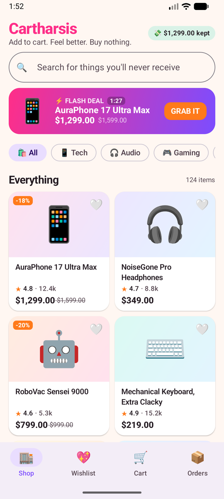
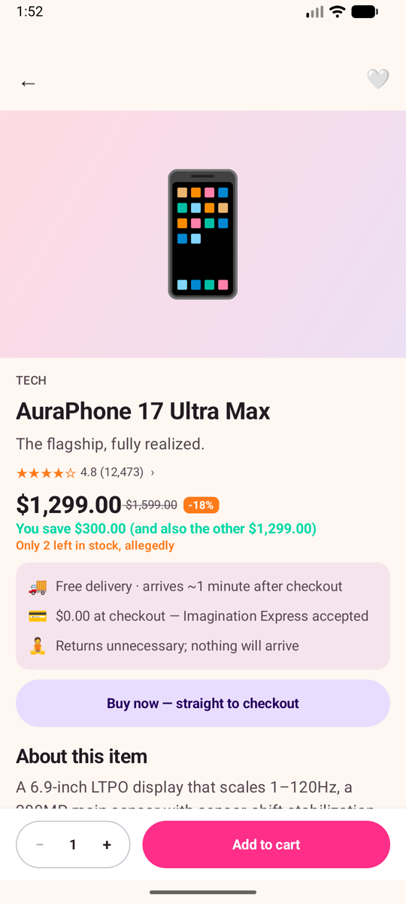
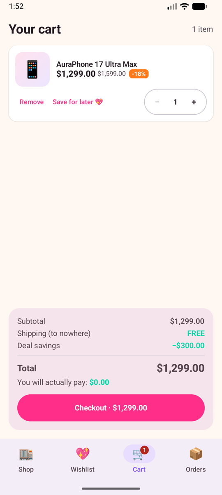
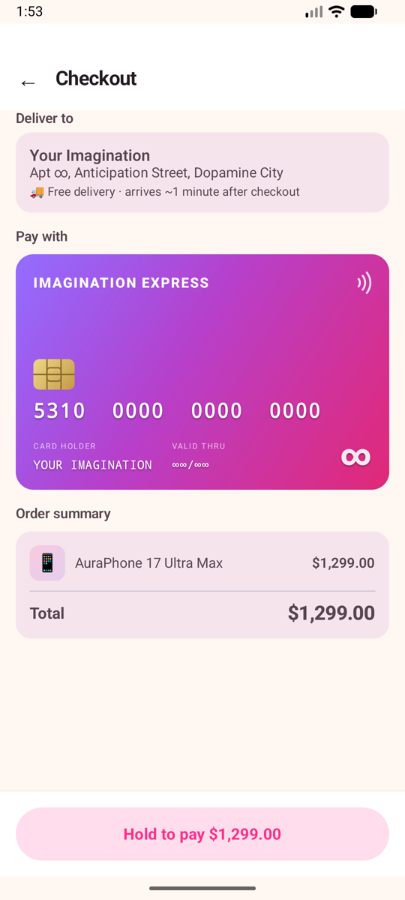
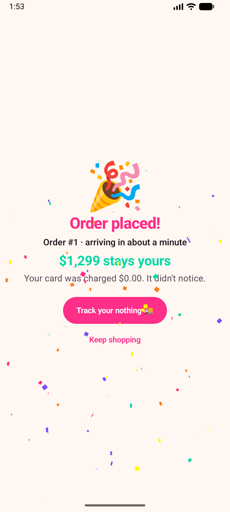
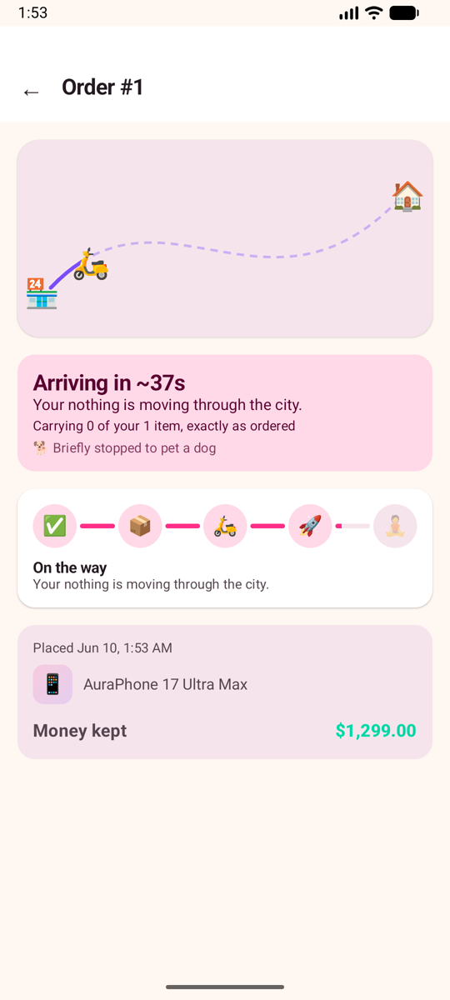

<div align="center">

# 🛒 Cartharsis

### Add to cart. Feel better. Buy nothing.

**A dopamine shopping simulator for Android.** The complete thrill of online shopping, browsing, deal hunting, cart filling, checkout, live courier tracking, with one crucial difference: nothing is real, nothing is charged, and nothing arrives.

</div>

<p align="center">
  
  
  
</p>
<p align="center">
  
  
  
</p>

## A real shop, selling nothing

Browse 124 products across 15 categories, written like a real marketplace: invented brands, plausible specs, honest-looking prices. Phones, hi-fi, gaming gear, skincare, camping kit, fried chicken, a decorative sword, and one premium brick. Flash deals rotate, wishlist prices mysteriously drop, and the recommendation rabbit hole goes as deep as you want.

## A checkout that feels like the real thing

Pay with the Imagination Express card (balance: infinite). You don't tap to buy, you **hold to pay the full price**, the bank takes a dramatic moment, a checkmark lands with a click you can feel, and then the punchline: your card was charged $0.00. Confetti. The money-you-kept counter ticks up. First orders and every tenth get the bigger sky.

## Watch nothing arrive

Every order ships instantly into a live tracking screen: a labeled stage tracker, a route map where a little courier carries your void across town (arriving in about a minute, occasionally by rocket), and small moments along the way, like briefly stopping to pet a dog. When nothing arrives, exactly as planned, your money is still yours.

## Reviews from verified non-buyers

Every product carries reviews from people who also received nothing and loved it. Category regulars review in their own voice, the occasional one-star poet waited by the door all day, and you can write your own review of the nothing you didn't get. It is pinned, editable, and survives restarts.

## Built to calm, not to hook

Cartharsis borrows the joy of shopping apps and leaves the harm. There is a money-not-spent counter, a daily urge-resisted streak that never guilts you, and notifications that only speak when you are away, never at night, and never more than once in a while. All the dopamine, none of the bill.

## Why this exists

The app is inspired by the "dopamine sites" trend from South Korea, where stressed and burned-out users visit fake delivery and shopping platforms for the pleasant anticipation of ordering, without spending money or feeding compulsive habits. The psychology is simple: most of the dopamine in shopping comes from anticipation, not ownership. Cartharsis keeps the anticipation and throws away the credit card bill.

- [Korea Times: Gen Z turn to 'dopamine sites' for quick comfort](https://www.koreatimes.co.kr/lifestyle/trends/20260527/gen-z-turn-to-dopamine-sites-for-quick-comfort)
- [SCMP: South Korea's lonely, stressed Gen Z find comfort in apps that do nothing](https://www.scmp.com/news/asia/east-asia/article/3354966/south-koreas-lonely-stressed-gen-z-find-comfort-apps-do-nothing)

## What this app will never do

- No real payments, no payment SDKs, no prices that mean anything
- No network calls: the entire catalog is local and fake
- No accounts, no tracking, no ads, no data leaving the device
- No dark patterns with consequences: all the theater, none of the harm

## Disclaimer

Cartharsis is a parody and a wellness toy. It is not a store. If you try to return a product, the product was never there. That's the point. 🧘

---

## For developers

| Layer | Choice |
|---|---|
| Language | Kotlin |
| UI | Jetpack Compose + Material 3, hand-rolled animations only |
| Architecture | Single activity, MVVM (`ViewModel` + `StateFlow`) |
| Navigation | Navigation Compose |
| Data | Hardcoded in-memory catalog; DataStore for wishlist, stats, streak, your reviews |
| Min / target SDK | 24 / 36 |

### Building

```bash
./gradlew assembleDebug      # build the APK
./gradlew test               # run unit tests
./gradlew connectedDebugAndroidTest   # instrumented smoke test (device/emulator)
./gradlew installDebug       # install on a connected device/emulator
```

Open the project in Android Studio and hit ▶ for the easy route.

### Project docs

- `CLAUDE.md`: architecture, conventions, and the design principles behind the catalog tone, notification policy, and reward moments
- `tasks.md`: the living task list and a phase-by-phase changelog
- `docs/screenshots/`: the images above, captured from the emulator at 1080x2400 and scaled to 540 wide
